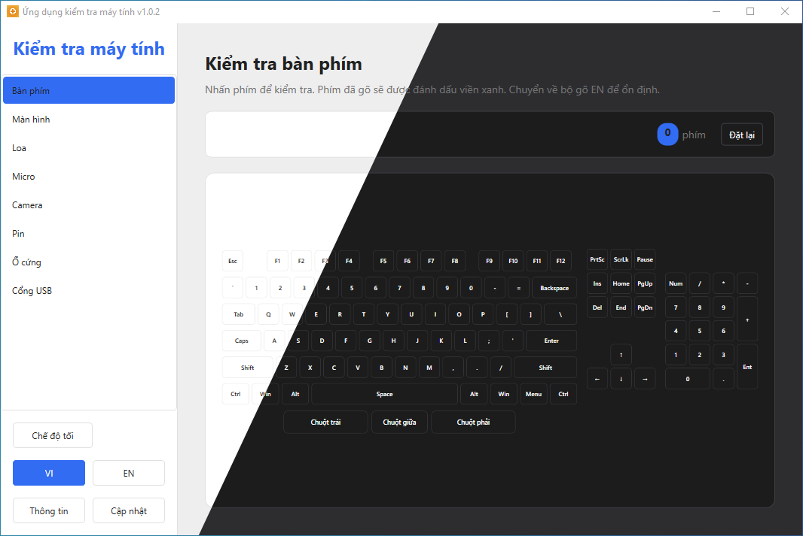

# Computer Test App (Ứng dụng kiểm tra máy tính)



---

## Tiếng Việt

[English](#english)

**Computer Test App** là một ứng dụng desktop trực quan giúp người dùng và kỹ thuật viên nhanh chóng kiểm tra các chức năng cơ bản của máy tính.

### Tính năng chính

1. **Kiểm tra bàn phím (Keyboard Test)**:
   - Giao diện phím ảo trực quan.
   - Ghi nhận phím bấm thực tế, đổi màu phím đã kiểm tra để phát hiện phím liệt, kẹt hoặc lỗi double-click.
   - Hỗ trợ kiểm tra các nút chuột (trái, phải, giữa).
2. **Kiểm tra màn hình (Screen Test)**:
   - Chế độ toàn màn hình để phát hiện điểm chết (dead pixel), hở sáng hoặc sai màu.
   - Nhấp chuột để đổi qua các màu đơn sắc tiêu chuẩn (Đỏ, Xanh lá, Xanh dương, Trắng, Đen...).
3. **Kiểm tra loa (Speaker Test)**:
   - Phát âm thanh kiểm tra độc lập kênh trái (Left) và kênh phải (Right) để xác nhận loa stereo hoạt động đúng.
   - Có tùy chọn phát âm thanh nhạc mẫu.
4. **Kiểm tra micro (Microphone Test)**:
   - Hiển thị danh sách micro đầu vào.
   - Đo thanh tín hiệu nhạy độ vào thời gian thực (Volume level).
   - Hỗ trợ ghi âm ngắn và phát lại để kiểm tra chất lượng âm thanh thu được.
5. **Kiểm tra camera (Webcam Test)**:
   - Hiển thị danh sách camera kết nối với máy tính.
   - Kiểm tra luồng hình ảnh trực tiếp (Live video feed).
6. **Kiểm tra độ chai pin (Battery Health)**:
   - Tạo và phân tích báo cáo pin hệ thống của Windows.
   - Hiển thị chi tiết: Dung lượng thiết kế (Design Capacity), dung lượng sạc đầy thực tế (Full Charge Capacity), độ chai pin (Wear Level), và chu kỳ sạc (Cycle Count).
7. **Kiểm tra ổ cứng (Disk Health)**:
   - Tích hợp công cụ `smartctl` (từ gói smartmontools) để đọc thông tin SMART của các ổ cứng SSD/HDD.
   - Hiển thị sức khỏe ổ cứng (Health %), trạng thái SMART, nhiệt độ, tổng số giờ hoạt động, và số lần bật/tắt.
8. **Kiểm tra cổng USB (USB Ports)**:
   - Lắng nghe và hiển thị thông tin thiết bị USB ngay khi được kết nối.
   - Nhận diện chuẩn USB (USB 1.x, USB 2.0, USB 3.x, USB4), Hub điều khiển và loại cổng cắm (có khả năng là Type-C).
9. **Cập nhật tự động (Auto Update)**:
   - Tự động kiểm tra phiên bản mới nhất từ GitHub Releases.
   - Tải xuống phân đoạn (chunk-based) đi kèm cửa sổ hiển thị tiến trình (ProgressBar) và phần trăm cụ thể.
   - Cho phép người dùng hủy tải (Cancel) bất kỳ lúc nào để tránh lãng phí băng thông.
   - Tự động chạy tập lệnh cài đặt nền để nâng cấp và tự khởi động lại ứng dụng.
10. **Đa ngôn ngữ & Giao diện (Theming & I18n)**:
    - Hỗ trợ đầy đủ tiếng Việt (VI) và tiếng Anh (EN).
    - Hỗ trợ chế độ Sáng/Tối (Light/Dark Mode) mượt mà.

### Hướng dẫn chạy dự án

Có thể tải ở trang **[Release](https://github.com/mhqb365/ComputerTestApp/releases)**, giải nén rồi mở lên sử dụng, hoặc tự build theo hướng dẫn dưới đây:

1. **Yêu cầu hệ thống**:
   - Hệ điều hành: Windows 7 trở lên.
   - .NET Framework 4.6.2 hoặc mới hơn.
2. **Biên dịch**:
   - Mở dự án trong **Visual Studio** hoặc build trực tiếp bằng CLI:
     ```bash
     dotnet build
     ```
3. **Chạy ứng dụng**:
   - Sau khi build, mở tệp `ComputerTestApp.exe` trong thư mục `bin/Debug/net462/` hoặc `bin/Release/net462/`.
   - Đảm bảo tệp `ExternalApp/smartmontools/smartctl.exe` được copy kèm theo để sử dụng tính năng kiểm tra ổ cứng.

---

## English

[Tiếng Việt](#tiếng-việt)

**Computer Test App** is an intuitive WPF desktop application that helps users and technicians quickly test basic computer functions.

### Key Features

1. **Keyboard Test**:
   - Interactive virtual keyboard visualizer.
   - Marks pressed keys to detect broken or stuck keys, and checks double-clicks.
   - Tests mouse buttons (Left, Middle, Right).
2. **Screen Test**:
   - Fullscreen mode to detect dead pixels, backlight bleeding, or color issues.
   - Click to rotate through solid primary colors.
3. **Speaker Test**:
   - Independent left and right audio channel tests to verify stereo speakers.
   - Sample music audio option for playback check.
4. **Microphone Test**:
   - Displays available microphones list.
   - Real-time sensitivity volume meter.
   - Supports recording a short audio sample and playing it back.
5. **Webcam Test**:
   - Detects connected webcams.
   - Displays real-time live video feed.
6. **Battery Health**:
   - Triggers and parses Windows system battery report.
   - Shows Design Capacity, Full Charge Capacity, Wear Level, and Cycle Count.
7. **Disk Health**:
   - Integrated with `smartctl` (smartmontools) to fetch SSD/HDD SMART status.
   - Shows health status, temperature, lifetime power-on hours, and power cycles.
8. **USB Ports**:
   - Listens to device attachment events.
   - Identifies USB standard (USB 1.x, 2.0, 3.x, USB4), controller hubs, and connector types (e.g. Type-C).
9. **Auto Update**:
   - Automatically checks for updates via GitHub Releases API.
   - Features chunk-based downloader with modern progress bar window.
   - Cancellation support (Cancel button) to stop active downloads.
   - Auto-executes updater script to install and restart application.
10. **Theming & Localization**:
    - Complete support for English (EN) and Vietnamese (VI).
    - Seamless Light and Dark mode options.

### Running the Project

You can download from **[Release](https://github.com/mhqb365/ComputerTestApp/releases)**, unzip it and run, or build it yourself following the instructions below:

1. **System Requirements**:
   - Windows 7 or newer.
   - .NET Framework 4.6.2+.
2. **Build**:
   - Open inside **Visual Studio** or build from terminal:
     ```bash
     dotnet build
     ```
3. **Execute**:
   - Run `ComputerTestApp.exe` located in `bin/Debug/net462/` or `bin/Release/net462/`.
   - Verify `ExternalApp/smartmontools/smartctl.exe` is placed next to the application assembly for disk diagnostics.
